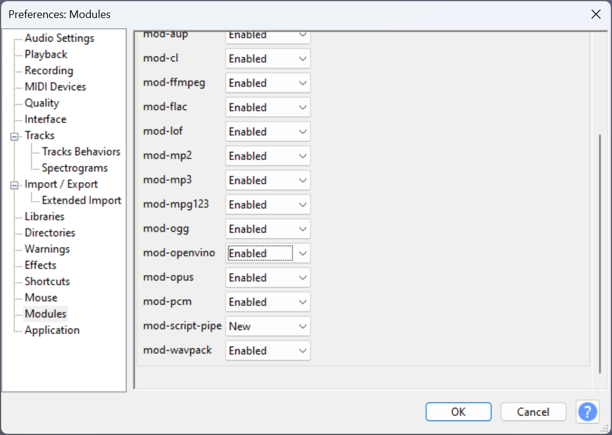

# Audacity OpenVINO module build for Windows :hammer:

Hi! The following is the process that we use when building the Audacity modules for Windows.

## High-Level Overview
Before we get into the specifics, at a high-level we will be doing the following:
* Cloning & building whisper.cpp with OpenVINO support (For transcription audacity module)
* Cloning & building Audacity 3.4.2 without modifications (just to make sure 'vanilla' build works fine)
* Adding our OpenVINO module src's to the Audacity source tree, and re-building it.

## Dependencies
Here are some of the dependencies that you need to grab. If applicable, I'll also give the cmd's to set up your environment here.
* CMake (https://cmake.org/download/)
* Visual Studio (MS VS 2019 / 2022 Community Edition is fine)
* python3 / pip - Audacity requires conan 2.0+ to be installed, and the recommended way to do that is through pip.  
* OpenVINO - You can use public version from [here](https://github.com/openvinotoolkit/openvino/releases/tag/2024.5.0). Setup your cmd.exe shell environment by running setupvars.bat:  
    ```
    call "C:\path\to\w_openvino_toolkit_windows_xxxx\setupvars.bat"
    ```
* OpenVINO Tokenizers Extension - Download package from [here](https://storage.openvinotoolkit.org/repositories/openvino_tokenizers/packages/). 
   Make sure that you download the version that matches the version of OpenVINO that you are using. For example, we are using [openvino_tokenizers_windows_2024.5.0.0_x86_64.zip](https://storage.openvinotoolkit.org/repositories/openvino_tokenizers/packages/2024.5.0.0/openvino_tokenizers_windows_2024.5.0.0_x86_64.zip)
   Download the zip package, and copy the DLLs into your ```w_openvino_toolkit_windows_xxxx\runtime\bin\intel64\Release``` folder.  
   
* Libtorch (C++ distribution of pytorch)- This is a dependency for many of the pipelines that we ported from pytorch (musicgen, htdemucs, etc). We are currently using this version: [libtorch-win-shared-with-deps-2.4.1+cpu.zip](https://download.pytorch.org/libtorch/cpu/libtorch-win-shared-with-deps-2.4.1%2Bcpu.zip). After extracting the package, setup environment like this:
    ```
    set LIBTORCH_ROOTDIR=C:\path\to\libtorch-shared-with-deps-2.4.1+cpu\libtorch
    set Path=%LIBTORCH_ROOTDIR%\lib;%Path%
    ```  
* OpenCL - To optimize performance for GPUs, we (lightly) use OpenCL with interoperability (i.e. remote tensor) APIs for OpenVINO. So, we need to download the OpenCL SDK. You can download this version: [OpenCL-SDK-v2023.04.17-Win-x64.zip](https://github.com/KhronosGroup/OpenCL-SDK/releases/download/v2023.04.17/OpenCL-SDK-v2023.04.17-Win-x64.zip). After extracting the package, setup environment like this:
    ```
    set OCL_ROOT=C:\path\to\OpenCL-SDK-v2023.04.17-Win-x64
    set Path=%OCL_ROOT%\bin;%Path%
    ```
    (Note -- 'OpenCL-SDK-v2023.04.17-Win-x64' folder pointed to by OCL_ROOT should be the one that contains 'bin', 'include', 'lib', etc. subdirectories.)
  

## Sub-Component builds
We're now going to build whisper.cpp. You should have a cmd.exe (not powershell!) shell running, and environment setup for above dependencies. To recap:  

    :: OpenVINO
    call "C:\path\to\w_openvino_toolkit_windows_xxxx\setupvars.bat"

    :: OpenCV
    set OpenCV_DIR=C:\path\to\opencv\build
    set Path=%OpenCV_DIR%\x64\vc16\bin;%Path%

    :: Libtorch
    set LIBTORCH_ROOTDIR=C:\path\to\libtorch-shared-with-deps-2.4.1+cpu\libtorch
    set Path=%LIBTORCH_ROOTDIR%\lib;%Path%

### Whisper.cpp 
```
:: Clone it  & check out specific v1.5.4 release tag.
git clone https://github.com/ggerganov/whisper.cpp
cd whisper.cpp
git checkout v1.5.4
cd ..

:: Create build folder
mkdir whisper-build
cd whisper-build

:: Run CMake, specifying that you want to enable OpenVINO support.
:: Note: Replace visual studio version if needed
cmake ..\whisper.cpp -A x64 -DWHISPER_OPENVINO=ON

:: Build it:
cmake --build . --config Release

:: Install built whisper collateral into a local 'installed' directory:
cmake --install . --config Release --prefix .\installed
```
With the build / install complete, the Audacity build will find the built collateral via the WHISPERCPP_ROOTDIR. So you can set it like this:
```
set WHISPERCPP_ROOTDIR=C:\path\to\whisper-build\installed
set Path=%WHISPERCPP_ROOTDIR%\bin;%Path%
```
(I'll remind you later about this though)

## Audacity 

Okay, moving on to actually building Audacity. Just a reminder, we're first going to just build Audacity without any modifications. Once that is done, we'll copy our openvino-module into the Audacity src tree, and built that.

### Audacity initial (vanilla) build
```
:: For Audacity 3.4.0+, conan 2.0+ is required. Install it like this:
pip install conan

:: clone Audacity
git clone https://github.com/audacity/audacity.git

:: Check out latest Audacity branch that our plugins are compatible with (currently, release-3.7.1)
cd audacity
git checkout release-3.7.1
cd ..

mkdir audacity-build
cd audacity-build

:: Run cmake (grab a coffee & a snack... this takes a while)
cmake ..\audacity -A x64 -DAUDACITY_BUILD_LEVEL=2

:: build it 
cmake --build . --config Release
```

When this is done, you can run Audacity like this (from audacity-build directory):
```
Release\Audacity.exe
```

### Audacity OpenVINO module build

Now we'll run through the steps to actually build the OpenVINO-based Audacity module.

First, clone this repo. This is of course where the actual Audacity module code lives.
```
:: clone it
git clone https://github.com/intel/openvino-plugins-ai-audacity.git

cd openvino-plugins-ai-audacity
```

We need to copy the ```mod-openvino``` folder into the Audacity source tree.
i.e. Copy ```openvino-plugins-ai-audacity\mod-openvino``` folder to ```audacity\modules```.

We now need to edit ```audacity\modules\CMakeLists.txt``` to add mod-openvino as a build target. You just need to add a ```add_subdirectory(mod-openvino)``` someplace in the file. For example:

```
...
foreach( MODULE ${MODULES} )
   add_subdirectory("${MODULE}")
endforeach()

#YOU CAN ADD IT HERE
add_subdirectory(mod-openvino)

if( NOT CMAKE_SYSTEM_NAME MATCHES "Darwin" )
   if( NOT "${CMAKE_GENERATOR}" MATCHES "Visual Studio*")
      install( DIRECTORY "${_DEST}/modules"
               DESTINATION "${_PKGLIB}" )
   endif()
endif()
...
```

Okay, now we're going to (finally) build the module. Here's a recap of the environment variables that you should have set:

```
:: OpenVINO
call "C:\path\to\w_openvino_toolkit_windows_xxxx\setupvars.bat"

:: Libtorch
set LIBTORCH_ROOTDIR=C:\path\to\libtorch-shared-with-deps-2.4.1+cpu\libtorch
set Path=%LIBTORCH_ROOTDIR%\lib;%Path%

:: Whisper.cpp 
set WHISPERCPP_ROOTDIR=C:\path\to\whisper-build\installed
set Path=%WHISPERCPP_ROOTDIR%\bin;%Path%

:: OpenCL
set OCL_ROOT=C:\path\to\OpenCL-SDK-v2023.04.17-Win-x64
set Path=%OCL_ROOT%\bin;%Path%
```

Okay, on to the build:  
```
:: cd back to the same Audacity folder you used to build Audacity before
cd audacity-build

:: and build the new target, mod-openvino.
:: (Note: CMake will automatically re-run since you modified CMakeLists.txt)
cmake --build . --config Release --target mod-openvino
```

If it all builds correctly, you should see mod-openvino.dll sitting in audacity-build\bin\Release\modules.

You can go ahead and run audacity-build\bin\Release\Audacity.exe

Once Audacity is open, you need to go to ```Edit -> Preferences```. And on the left side you'll see a ```Modules``` tab, click that. And here you (hopefully) see mod-openvino entry set to ```New```. You need to change it to ```Enabled```, as shown in the following picture.  



Once you change to ```Enabled```, close Audacity and re-open it. When it comes back up, you should now see the OpenVINO modules listed.

## Installing the OpenVINO models
In order for the OpenVINO effects to work, you need to install the OpenVINO models. At runtime, the plugins will look for these models in a ```openvino-models``` directory.  
Here are the commands that you can use (from cmd.exe) to create this directory, and populate it with the required models.
```
:: Create an empty 'openvino-models' directory to start with
mkdir openvino-models

:: Since many of these models will come from huggingdface repo's, let's make sure git lfs is installed
git lfs install

::************
::* MusicGen *
::************
mkdir openvino-models\musicgen

:: clone the HF repo
git clone https://huggingface.co/Intel/musicgen-static-openvino

:: unzip the 'base' set of models (like the EnCodec, tokenizer, etc.) into musicgen folder
tar -xf musicgen-static-openvino\musicgen_small_enc_dec_tok_openvino_models.zip -C openvino-models\musicgen

:: unzip the mono-specific set of models
tar -xf musicgen-static-openvino\musicgen_small_mono_openvino_models.zip -C openvino-models\musicgen

:: unzip the stereo-specific set of models
tar -xf musicgen-static-openvino\musicgen_small_stereo_openvino_models.zip -C openvino-models\musicgen

:: Now that the required models are extracted, feel free to delete the cloned 'musicgen-static-openvino' directory.
rmdir musicgen-static-openvino /s /q

::*************************
::* Whisper Transcription *
::*************************

:: clone the HF repo
git clone https://huggingface.co/Intel/whisper.cpp-openvino-models

:: Extract the individual model packages into openvino-models directory
tar -xf whisper.cpp-openvino-models\ggml-base-models.zip -C openvino-models
tar -xf whisper.cpp-openvino-models\ggml-small-models.zip -C openvino-models
tar -xf whisper.cpp-openvino-models\ggml-small.en-tdrz-models.zip -C openvino-models

:: Now that the required models are extracted, feel free to delete the cloned 'whisper.cpp-openvino-models' directory.
rmdir whisper.cpp-openvino-models /s /q

::********************
::* Music Separation *
::********************

:: clone the HF repo
git clone https://huggingface.co/Intel/demucs-openvino

:: Copy the demucs OpenVINO IR files
copy /y demucs-openvino\htdemucs_v4.bin openvino-models
copy /y demucs-openvino\htdemucs_v4.xml openvino-models

:: Now that the required models are extracted, feel free to delete the cloned 'demucs-openvino' directory.
rmdir demucs-openvino /s /q

::*********************
::* Noise Suppression *
::*********************

:: Clone the deepfilternet HF repo
git clone https://huggingface.co/Intel/deepfilternet-openvino

:: extract deepfilter2 models
tar -xf deepfilternet-openvino\deepfilternet2.zip -C openvino-models

:: extract deepfilter3 models
tar -xf deepfilternet-openvino\deepfilternet3.zip -C openvino-models

:: TODO: Add remaining models!
```
Now that you have generated the ```openvino-models``` directory, copy it to the same folder as ```Audacity.exe``` (e.g. ```audacity-build\bin\Release\```).

# Need Help? :raising_hand_man:
For any questions about this build procedure, feel free to submit an issue [here](https://github.com/intel/openvino-plugins-ai-audacity/issues)

