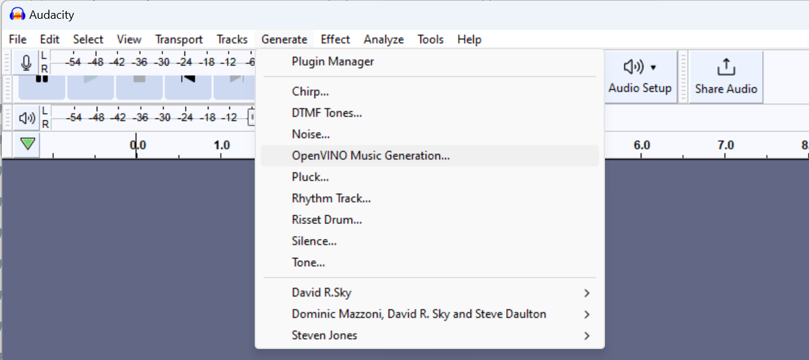
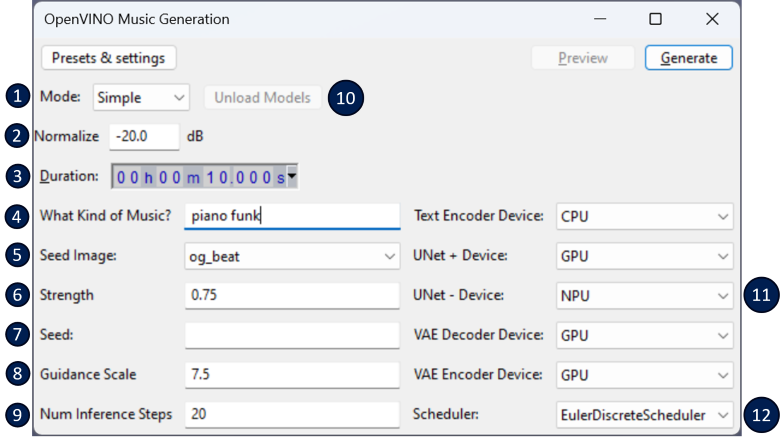
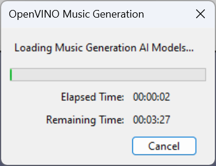
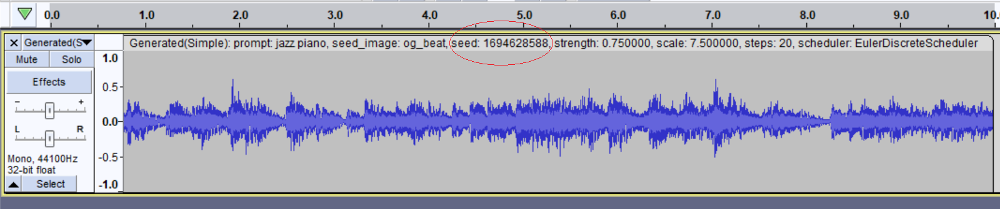
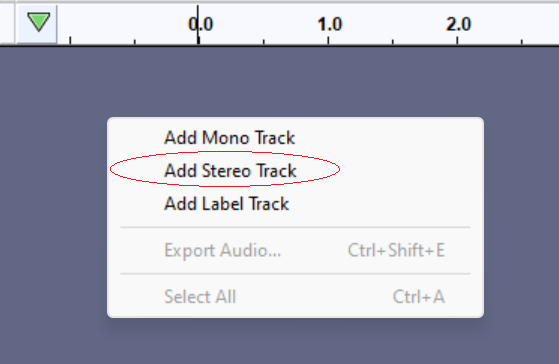
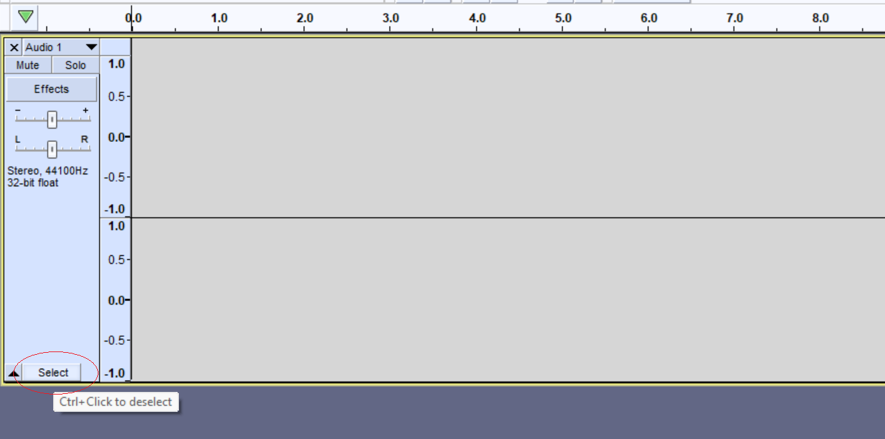
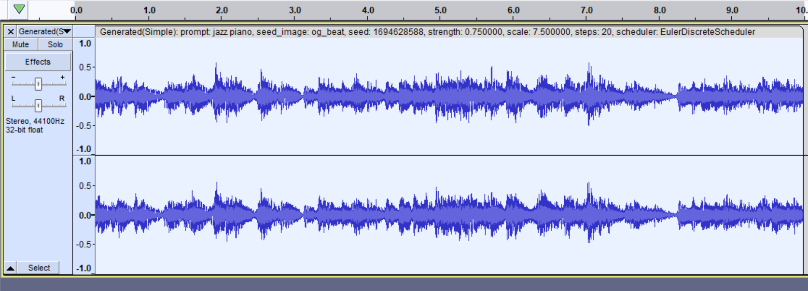
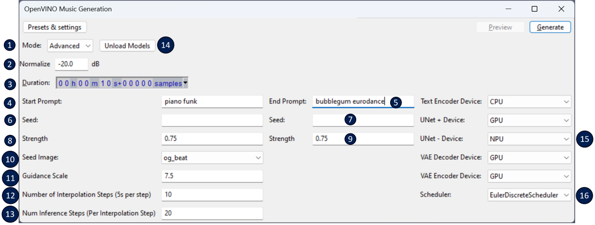

# OpenVINO™ Music Generation :notes:

This feature allows a user to generate snippets of music from a text prompt (and other controls).  

It can be found under the **Generate** menu:

## Simple mode 
By default, *Music Generation* will come up in **Simple** mode. See below for a description of the properties that can be set in this mode:  

1. **Mode**: Used to select between *Simple* and *Advanced* modes
2. **Normalize**: The decibel level to normalize the generated audio to.
3. **Duration**: The desired duration of the generated audio snippet. In simple mode, the maximum duration is ~60s.
4. **What kind of Music?** prompt: This is used to describe the type of music to generate. It can be a genre, an artist, a style, etc. For example, "Piano funk", "Bubblegum Eurodance", "Scott Joplin style ragtime piano". 
5. **Seed Image**: This is used to select between a number of pre-defined 'base' ~5s audio snippets that are used to define a starting structure (tempo, etc.) for the generated audio. Each ~5s of audio that is generated will be a modified form of the 'base' snippet. If 'None' is selected, there will not be a 'base' audio snippet used to define the structure (tempo, melody) of the generated audio snippet -- so generated results may be more creative -- but the drawback to 'None' is that the maximum duration of the generated audio will be ~5 seconds.   
6. **Strength**: A value between 0 and 1. This is used to control how far the generated audio is allowed to deviate away from the 'base' audio snippet (the seed image described above). The closer the value is to 0, the closer the generated results will be to the pre-defined audio snippet. The closer the value is to 1, the further away the generated result may be. For example, 0.1 will generate something with only slight modifications. A value close to 1, such as 0.9, will allow the generated audio snippet to deviate really far away from the base audio snippet, in terms of tempo, pitch, melody, etc. It's also used as a multiplier to the number of UNet iterations -- TL;DR, this means that lower strength values will produce audio more quickly.
7. **Seed**: Used to initialize the RNG (random noise generator). If left blank, an arbitrary value is chosen as a seed, and will be different each time you click 'Generate', and so generated results may greatly vary for each 'Generate'. And this can be a good thing for experimentation. To generate consistent results, or to recreate something previously generated, the seed should be set.
8. **Guidance Scale**: A value that represents how much the generation will adhere to your text prompt. Recommended to set between 7 and 9.
9. **Num Inference Steps**: The number of UNet iterations used to generate each 5 seconds of audio. In general, the higher this is set, the higher quality the generated audio will be. But, you may start seeing diminished results starting at 25 iterations or so. 
10. **Unload Models**: For the first 'Generate' after Audacity is opened, the AI models are loaded into memory. Once loaded, they are kept in memory to reduce the time it takes for successive calls to 'Generate' (which is nice for experimentation). Once you are done generating, and happy with the results, you can click 'Unload Models' to free up system memory.
11. **Device Selection**: The set of OpenVINO™ devices that will be used to run the various stages of the stable diffusion pipeline. The plugin should default these to something reasonable -- but feel free to adjust if you want to experiment with different devices.
12. **Scheduler**: The algorithm used for denoising at each iteration of the UNet loop. We've found that EulerDiscreteScheduler usually produces the most pleasing results, but feel free to experiment.  

**Tip**: Don't get overwhelmed. If you're just starting out, you only need to worry about filling in the **What kind of Music?** & **Duration** properties. The rest of these parameters are defaulted to something should give somewhat reasonable results :thumbsup:  

After clicking *Generate*, you'll see this dialog window pop up:  
  

At this stage, the AI models are getting loaded to your PC's local accelerators (e.g. CPU, GPU, NPU, etc.). This usually takes 10 to 30 seconds. If it's the *very* first time you're running this after installing the plugins, it can take a bit longer (e.g. could be up to 5 minutes) because the AI models need to be *compiled* specifically for your devices. These *compiled* models will be cached on disk though -- so it should run much faster the next time that it needs to load these.  

The audio snippet will be generated as a new track, which would look something like this:  
  

**Tip**: The generated track will be labeled with the properties that were used to generate the track. One important property to take note of is the **seed** (circled above). If you wanted to recreate this *exact* audio snippet again, you would need to use this seed value.

**Tip**: If you want to generate a stereo track (instead of mono), follow these steps.
1. Right-click someplace on your blank canvas and select 'Add Stereo Track':  
    
2. Select the track:  
    
3. Choose **Generate -> OpenVINO Music Generation** from the Audacity menu, set your properties, and click **Generate**. The generated stereo snippet will be generated *into* your selected stereo track:  
    

## Advanced mode
Advanced mode is used to generate audio snippets that transition from a *start prompt* to an *end prompt*. See below for a description of the properties that can be set in this mode:  

1. **Mode**: Used to select between *Simple* and *Advanced* modes
2. **Normalize**: The decibel level to normalize the generated audio to.
3. **Duration**: The desired duration of the generated audio snippet. In advanced-mode, the maximum duration is approximately *Number of Interpolation Steps* x 5 seconds.
4. **Start Prompt**: The description (genre, artist style, etc.) of how you want the audio snippet to start. The first 5 seconds will be generated entirely from this prompt, and each 5 second snippet afterward will slowly move toward the *End Prompt*
5. **End Prompt**: The description (genre, artist style, etc.) of how you want the audio snippet to end. The last 5 seconds (assuming duration is set to maximum allowed) will be generated entirely from this prompt.
6. **Start Seed**: Seed to use for first 5 seconds. Each 5 second afterward will be affected by *End Seed* as well.
7. **End Seed**: Seed to use for last 5 seconds.
8. **Start Strength**: Same description as *Strength* described for simple mode. This is the strength to use for first 5 seconds of generated audio. Each 5 second snippet afterward will be affected by the *End Strength*
9. **End Strength**: The strength to use for the last 5 seconds of generated audio.
10. **Seed Image**: See description under *Simple* mode above.
11. **Guidance Scale**: A value that represents how much the generation will adhere to your text prompt. Recommended to set between 7 and 9.
12. **Number of Interpolation Steps**: This controls the number of 5 second snippets that are generated to transition from the *Start Prompt* to the *End Prompt*. The maximum duration is approximately this value x 5 seconds. For example if this is set to 2, the maximum duration will be ~10 seconds -- the first 5 seconds will be generated purely from the *Start* properties, and the last 5 seconds will be purely from the *End* properties -- there will most likely be an *abrupt* transition between these 2 audio snippets. Setting this to something higher, let's say 10, the maximum duration will be ~50s -- the first 5 seconds will be generated purely from the *Start* properties, and the last 5 seconds will be purely from the *End* properties, but the generated 5-second snippets in-between these will be something *in-between*... so the transition from successive audio segments should sounds much smoother in this case.
13. **Number of Inference Steps**: See description under *Simple* mode above.
14. **Unload Models**: See description under *Simple* mode above.
15. **Device Selection**: See description under *Simple* mode above.
16. **Scheduler**: See description under *Simple* mode above.

**Tip**: To quickly set the maximum duration (based on *Number of Interpolation Steps* property), try setting a super long duration (like 1 hour) -- the duration will automatically get clipped to the max supported duration :thumbsup:

**Note**: Our implementation of Music Generation heavily referenced the original open-source Riffusion project, which can be found here: https://github.com/riffusion/riffusion-app
