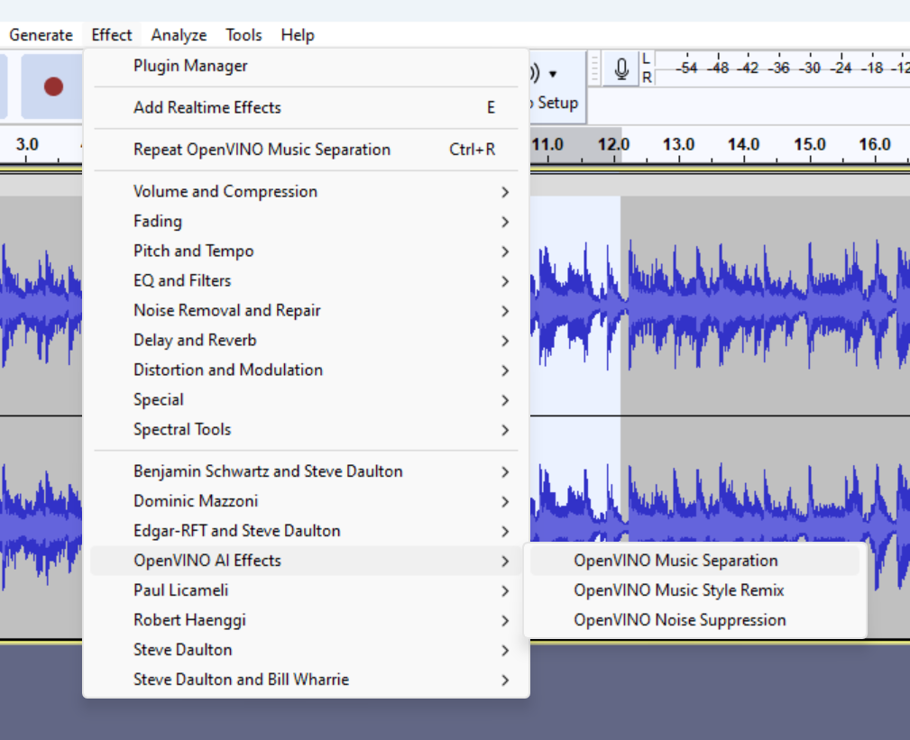
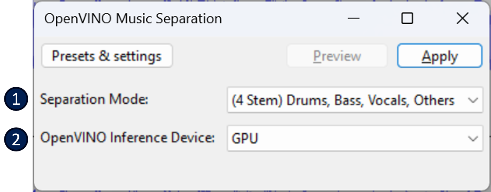

# OpenVINO™ Music Separation :musical_note:

This feature allows a user to separate a mono or stereo track into individual stems -- Drums, Bass, Vocals, & Other instruments.  

You can find this feature in the **Effect** menu:

To start, select a portion of a mono or stereo track, and select *OpenVINO Music Separation* from the menu.  

## Description of properties
See below for a description of the properties that can be set for this effect:  
  
1. **Separation Mode**: Here you can either choose *2-Stem*, which will produce 2 new tracks (Instrumental, Vocals), or you can select *4-Stem* which will produce 4 new tracks (Drums, Bass, Other Instruments, Vocals). 
2. **OpenVINO Inference Device**: The OpenVINO™ device that will be used to run the music separation AI model (demucs v4)

After clicking *Apply*, you'll see this dialog window pop up:  

At this stage, the Music Separation AI model is getting loaded to the chosen device (e.g. CPU, GPU, etc.). This usually takes 10 to 30 seconds if it's the first time running with this device after installing these plugins since it needs to compile the model specifically for the device you've chosen. This compiled model will be cached on disk though -- so it should run much faster the next time that it is loaded.

When completed, either 2 or 4 new tracks will show up in the Audacity workspace. For example in *4-Stem* mode, the generated tracks would look something like the following. 

**Note**: The generated tracks will have "-Drums", "-Bass", "-Vocals", etc. appended to the track name so that you can easily tell them apart.
