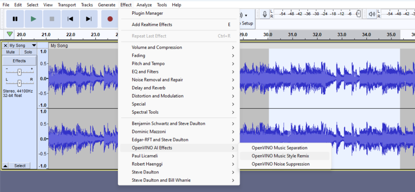
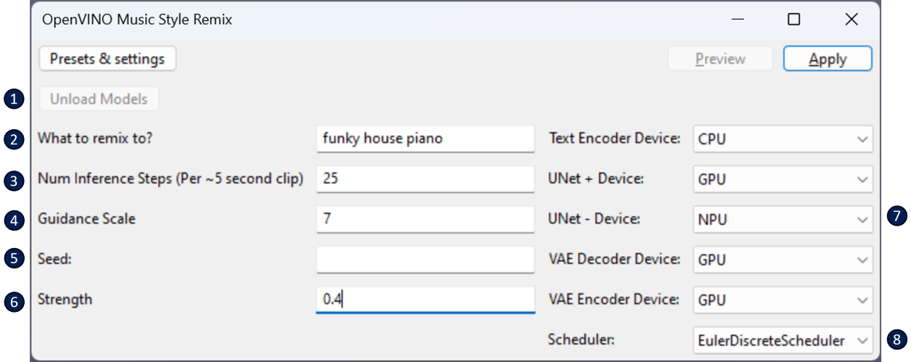
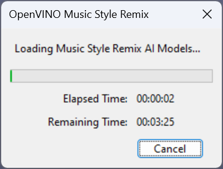
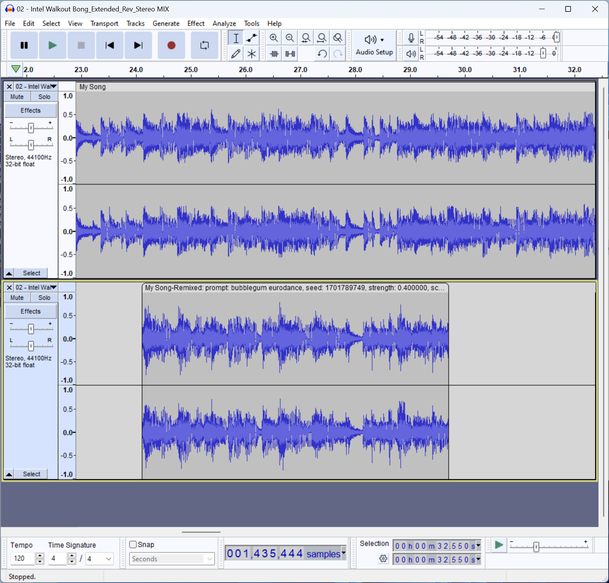

# OpenVINO™ Music Style Remix :cd:

This feature allows a user to remix a portion of a track, given a text prompt. You can find this feature under the **Effect** menu:

To start, select a portion of a mono or stereo track, and select *OpenVINO Music Style Remix* from the menu.  

**Tip**: It's recommended to start with a very short snippet of audio (5 to 15 seconds) to experiment with, keeping in mind that alot of processing is performed for each 5 seconds of audio that is chosen to generate the remix. 

## Description of properties
See below for a description of the properties that can be set for this effect:  
  
1. **Unload Models**: For the first use of this effect after Audacity is opened, the AI models are loaded into memory. Once loaded, they are kept in memory to reduce the time it takes to run it again. Once you are done remixing, and happy with the results, you can click 'Unload Models' to free up system memory.
2. **What to remix to?** prompt: This is used to describe the genre or style for how you want your music selection to be remixed.
3. **Num Inference Steps**: The number of UNet iterations used to remix each 5 seconds of audio. In general, the higher this is set, the higher quality the generated audio will be (at the cost of time taken to remix). But, you may start seeing diminished results starting at 25 iterations or so.
4. **Guidance Scale**: A value that represents how much the AI processing  will adhere to your text prompt. Recommended to set between 7 and 9.
5. **Seed**: Used to initialize the RNG (random noise generator). If left blank, an arbitrary value is chosen as a seed, and will be different each time you perform a remix, even if you use the same prompt, etc. This can be a good thing if you're experimenting.. To generate consistent results, or to recreate something previously generated, the seed should be set. More on this in below tips.
6. **Strength**: A value between 0 and 1. This is used to control how far the remixed audio is allowed to deviate away from the original. The closer the value is to 0, the closer the generated results will be to the original audio. The closer the value is to 1, the further away the generated result may be. For example, 0.1 will generate something with only slight modifications. A value close to 1, such as 0.9, will allow the generated audio snippet to deviate really far away from the original snippet, in terms of tempo, pitch, melody, etc. It's also used as a multiplier to the number of UNet iterations -- TL;DR, this means that lower strength values will produce audio more quickly.
7. **Device Selection**: The set of OpenVINO™ devices that will be used to run the various stages of the stable diffusion pipeline. The plugin should default these to something reasonable -- but feel free to adjust if you want to experiment with different devices.
8. **Scheduler**: The algorithm used for denoising at each iteration of the UNet loop. We've found that EulerDiscreteScheduler usually produces the most pleasing results, but feel free to experiment.

**Tip**: Don't get overwhelmed. If you're just starting out, you only need to worry about filling in the **What to remix to?** property. The rest of these parameters are defaulted to something should give somewhat reasonable results :thumbsup: 

After clicking *Apply*, you'll see this dialog window pop up:  

At this stage, the AI models are getting loaded to your PC's local accelerators (e.g. CPU, GPU, NPU, etc.). This usually takes 10 to 30 seconds. If it's the *very* first time you're running this after installing the plugins, it can take a bit longer (e.g. could be up to 5 minutes) because the AI models need to be *compiled* specifically for your devices. These *compiled* models will be cached on disk though -- so it should run much faster the next time that it needs to load these.  

The remixed audio will show up as a new track, for example:

**Tip**: The remixed track will be labeled with the properties that were used to remix the track. One important property to take note of is the **seed** value. If you wanted to recreate this *exact* audio snippet again, you would need to use this seed value.

**Tip**: As an experient, try setting to seed to a constant value (say, 1), and remix the same portion of a track twice with different strengths (say, 0.4 for one and 0.6 for the next). Compare the generated results... you'll find that the higher strength version has deviated a bit more from your original track.

**Tip**: This feature pairs really well with **Music Separation**! Try separating the instrumentals from the vocals, remixing the instrumental track, and then adding original vocals on top! :sunglasses:

**Note**: Our implementation of Music Style Remix heavily referenced the original open-source Riffusion project, which can be found here: https://github.com/riffusion/riffusion-app
