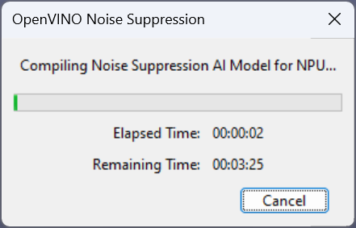

# OpenVINO™ Noise Suppression :broom:

This feature removes background noise from an audio sample containing spoken audio.  

It can be found under the **Effect** menu:  

## Description of properties 
See below for a description of the properties that can be set for this effect:  

1. **OpenVINO Inference Device**:  The OpenVINO™ device that will be used to run the noise suppression model.
2. **Device Details**: Clicking this button will give more detailed information about your devices, and device-mapping. For example, this can be useful if you have multiple GPUs and to easily understand which is mapped to 'GPU.0', and 'GPU.1', etc.
3. **Noise Suppression Model**: Used to select which noise-suppression model to use. Right now we support *deepfilternet2*, *deepfilternet3*, and *denseunet*. It's recommended to use one of the deepfilternet models, as *denseunet* is included only for legacy purposes.
4. **Advanced Options** : Check this to view advanced controls for the current selected model. 
5. **Advanced Options for Given Model**: Note that the available controls can be different for each supported model. 

After clicking *Apply*, you'll see this dialog window pop up:  

At this stage, the noise suppression AI model is getting loaded to the chosen device (e.g. CPU, GPU, NPU, etc.). This usually takes 10 to 30 seconds if it's the first time running with this device after installing these plugins since it needs to compile the model specifically for the device you've chosen. These *compiled* model will be cached on disk though -- so it should run much faster the next time that it is loaded.

This effect directly modifies the selected track(s).
