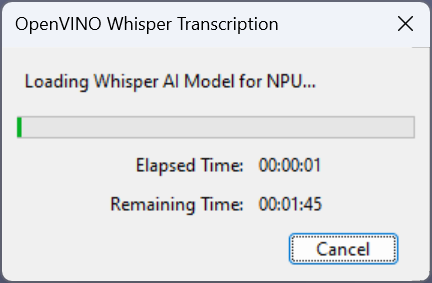
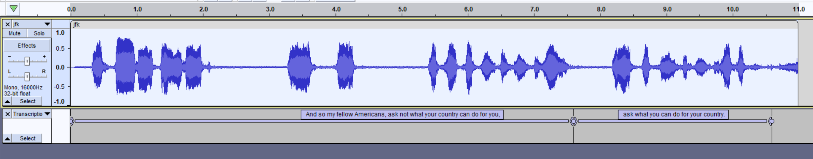

# OpenVINO™ Whisper Transcription :microphone:

This feature performs speech transcription or translation for a mono or stereo track, producing a label track.

It can be found under the **Analyze** menu:  

## Description of properties  
See below for a description of the properties that can be set for this analyzer:  

1. **OpenVINO Inference Device**: The OpenVINO™ device that will be used to run the whisper encode model. This should default to something reasonable.
2. **Device Details**: Clicking this button will give more detailed information about your devices, and device-mapping. For example, this can be useful if you have multiple GPUs and to easily understand which is mapped to 'GPU.0', and 'GPU.1', etc.
3. **Whisper Model**: Drop-down list to whisper model to use. This will show the list of whisper models available (The ones you chose to download at installation time). *base* is the fastest model available, and usually produces reasonable results. If you want more accurate transcriptions (especially if the source language is not english), you may want to choose a larger model. The available models, in terms of size / complexity / expected processing time is:
   - base
   - small (and small.en-tdrz)
   - medium
   - large (v1, v2, v3)
4. **Mode**: Select between *transcribe* and *translate*. Set to *translate* if you want the output to be in english, regardless of the source language. Set to *transcribe* if you want the output to be in the same language as the source audio.
5. **Source Language**: Gives the ability to explicitly set the source language. The default is *auto*, which will perform auto-detection.
6. **Advanced Options**: Check this to view advanced controls (Not needed for most users).
7. **Initial Prompt** (*Advanced Option*): This text prompt can be used to improve the quality of the transcripts by giving some contextual information like names, acronymns, etc. See [here](https://platform.openai.com/docs/guides/speech-to-text/prompting) for more details about how this can be used.
8. **Max Segment Length** (*Advanced Option*): Maximum segment length in characters. Set to 1 to produce 'word level' transcripts (which is [experimental feature by whisper.cpp](https://github.com/ggerganov/whisper.cpp?tab=readme-ov-file#word-level-timestamp-experimental))
9. **Beam Size** (*Advanced Option*): Beam size for beam search
10. **Best Of** (*Advanced Option*): Number of best candidates to keep

After clicking *Apply*, you'll see this dialog window pop up:  

At this stage, the whisper AI model is getting loaded to the chosen device (e.g. CPU, GPU, NPU, etc.). This usually takes 10 to 30 seconds if it's the first time running with this device after installing these plugins since it needs to compile the model specifically for the device you've chosen. These *compiled* model will be cached on disk though -- so it should run much faster the next time that it is loaded.

The transcription show up as a new label track, for example:

**Note**: The **small.en-tdrz** is a special model which supports *experimental* built-in *turn-based diarization*. In this case, two label tracks will be populated and labels will alternate between these two tracks at each detected 'speaker change'

**Note**: Our implementation of Whisper Transcription & Translation uses whisper.cpp: https://github.com/ggerganov/whisper.cpp

