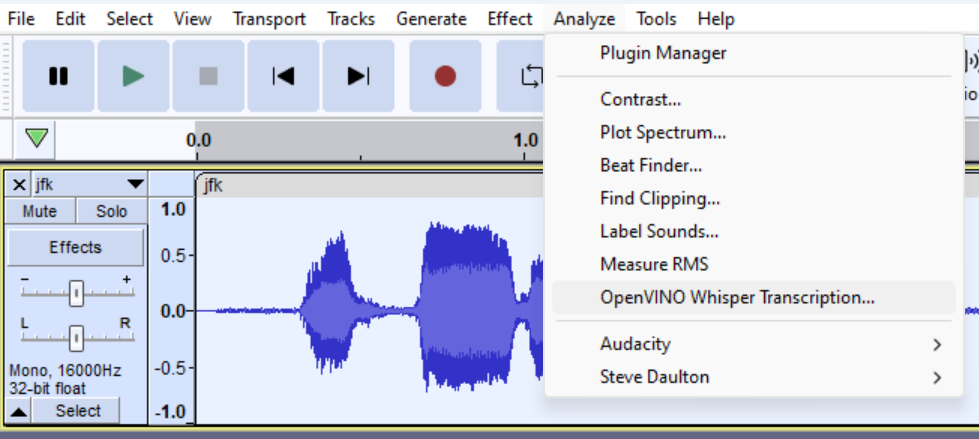
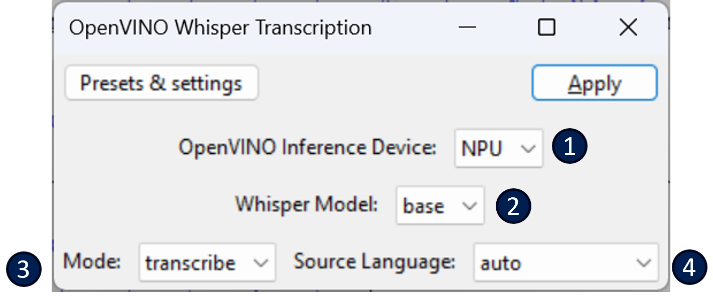

# OpenVINO™ Whisper Transcription :microphone:

This feature performs speech transcription or translation for a mono or stereo track, producing a label track.

It can be found under the **Analyze** menu:

## Description of properties  
See below for a description of the properties that can be set for this analyzer:  
  
1. **OpenVINO Inference Device**: The OpenVINO™ device that will be used to run the whisper encode model. This should default to something reasonable.
2. **Whisper Model**: The whisper model to use. Right now, we are only supporting *base* model, but support for others may come in the future.
3. **Mode**: Select between *transcribe* and *translate*. Set to *translate* if you want the output to be in english, regardless of the source language. Set to *transcribe* if you want the output to be in the same language as the source audio.
4. **Source Language**: Gives the ability to explicitly set the source language. The default is *auto*, which will perform auto-detection.

After clicking *Apply*, you'll see this dialog window pop up:  

At this stage, the whisper AI model is getting loaded to the chosen device (e.g. CPU, GPU, NPU, etc.). This usually takes 10 to 30 seconds if it's the first time running with this device after installing these plugins since it needs to compile the model specifically for the device you've chosen. These *compiled* model will be cached on disk though -- so it should run much faster the next time that it is loaded.

The transcription show up as a new label track, for example:

**Note**: Our implementation of Whisper Transcription & Translation uses whisper.cpp: https://github.com/ggerganov/whisper.cpp

